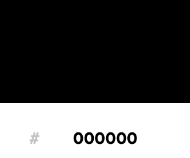
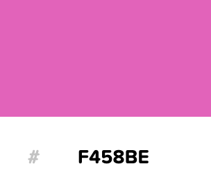
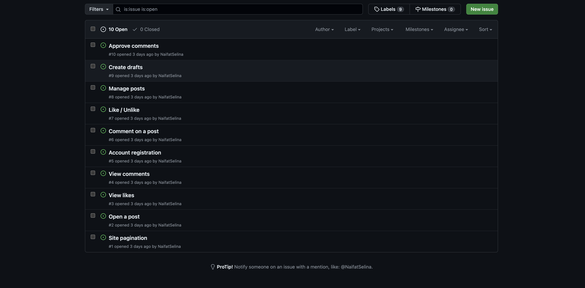
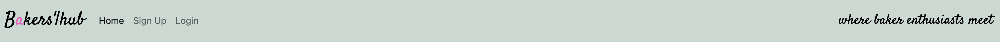
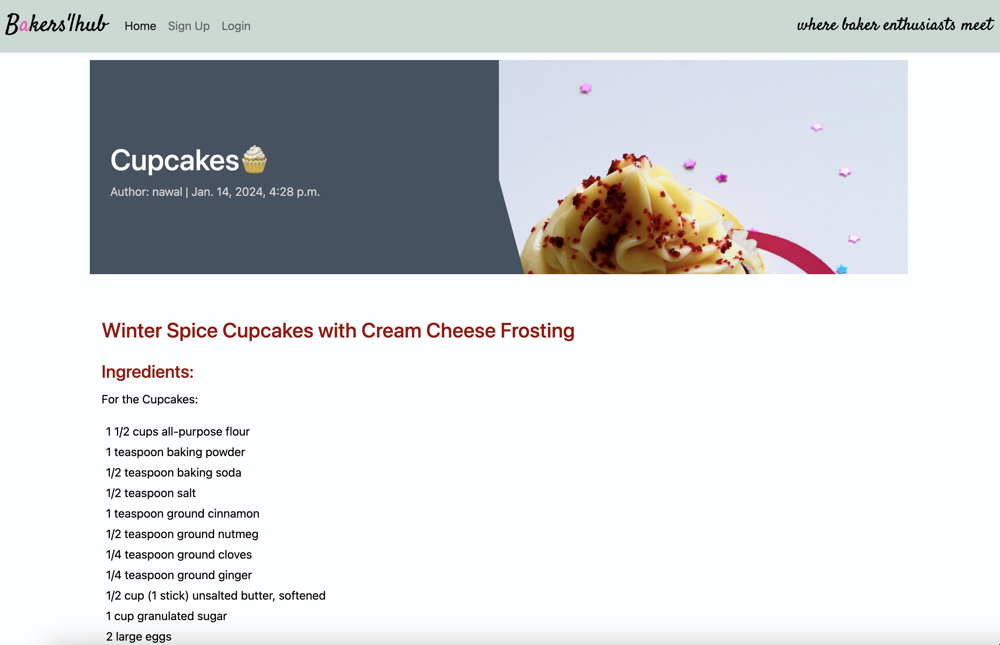

# **_Bakers Hub - Project Portfolio 4 - Full Stack_**

Bakers Hub is a dynamic online platform that serves as a community hub for baking enthusiasts and professionals. This project is designed to provide a comprehensive experience for users, offering both a user-friendly front-end for accessing and sharing baking recipes and a robust back-end management system for contributors and administrators. I wanted to keep this application very simple and sleek, with room for improvement, I wanted the application to be purely about the baking and not about anything flashy.

This is for the real bakers and for aspiring!

You can view the live site here - <a href="https://bakershub-2af44a4fc0e7.herokuapp.com/" target="_blank" rel="noopener">Bakers Hub</a>

# Contents

* [**Objective**](<#objective>)
* [**User Experience UX**](<#user-experience-ux>)
    * [User Stories](<#user-stories>)
    * [Design Prototype](<#design-prototype>)
    * [Site Structure](<#site-structure>)
    * [Design Choices](<#design-choices>)
    *  [Typography](<#typography>)
    *  [Colour Scheme](<#colour-scheme>)
    * [Project Management](<#project-management>)
* [**Existing Features (Site User)**](<#existing-features-for-site-user>)
    * [Site Navigation Bar](<#site-responsive-navigation-bar>)
    * [Article](<#article>)
    * [Article Details](<#article-details>)
    * [Comment](<#comment>)
    * [Like](<#like>)
    * [Footer](<#footer>)
    * [Sign Up](<#sign-up>)
    * [Login](<#login>)
* [**Existing Features (Admin)**](<#existing-features-for-admin>)
    * [Articles](<#Articless>)
    * [Comments](<#comments>)
    * [Accounts](<#accounts>)
* [**Future Features**](<#future-features>)
    * [Article Creation](<#article-creation>)
    * [Gallery](<#gallery>)
    * [User Profile Page](<#user-profile-page>)
* [**Technologies Used**](<#technologies-used>)
* [**Python Packages**](<#python-packages>)
* [**Bugs and Fixes**](<#bugs-and-fixes>)
* [**Testing**](<#testing>)
* [**Deployment To Heroku**](<#deployment-to-heroku>)
* [**Credits**](<#credits>)
    * [**Content**](<#content>)
    * [**Media**](<#media>)
*  [**Acknowledgments**](<#acknowledgements>)

# Objective

For my fourth project, I aim to develop a practical platform for a baking community, showcasing my proficiency in various technologies. The primary goal is to create an authentic and user-friendly website that can be seamlessly applied in a real-world context. This project will serve as a testament to my expertise in HTML, CSS, JavaScript, Python, and the Django Framework, highlighting attention to detail testing practices throughout the development process.

[Back to top](<#contents>)

# User Experience (UX)

## User Stories

### Site User

|  | | |
|:-------:|:--------|:--------|
| As a Site User | I can view a list of posts so that I can select one to read | &check; |
| As a Site User | I can click on a post so that I can read the full text | &check; |
| As a Site User | I can view the number of likes on each post so that I can see which is the most popular or viral | &check; |
| As a Site User | I can view comments on an individual post so that I can read the conversation | &check; |
| As a Site User | I can register an account so that I can comment and like | &check; |
| As a Site User | I can leave comments on a post so that I can be involved in the conversation | &check; |
| As a Site User | I can like or unlike a post so that I can interact with the content| &check; |

### Site Admin

|  | | |
|:-------:|:--------|:--------|
| As a Site Admin | I can view the number of likes on each post so that I can see which is the most popular or viral | &check; |
| As a Site Admin | I can view comments on an individual post so that I can read the conversation | &check; |
| As a Site Admin | I can create, read, update and delete posts so that I can manage my blog content| &check; |
| As a Site Admin | I can create draft posts so that I can finish writing the content later| &check; |
| As a Site Admin | I can approve or disapprove comments so that I can filter out objectionable comments | &check; |

## Design Prototype

The design wireframes were created using [Figma](https://www.figma.com/). I created a very basic wire frame as I knew that I didn't wannt the webpage to be too complicated, I wanted the focus to just be on recipes and I wanted it to be accessable for all- complicated webpages reduce accessibility and I highly wanted to avoid this. This is an extremely important part of the design process as it allows me to understand what components I want to add where.  

[Back to top](<#contents>)

## Site Structure

* Main User Website
    * Home, Sign Up, Article Detail, Login.
    * Accessible, simple and cohesive design.
    * Simple, easy viewing of different recipes.
    * Interaction is easy with just liking and commenting- no overstimulation.

* Admin
    * Functionality to manage and add to articles, comments and accounts.

## Design Choices

 * ### Typography
      The font I chose for the main 'Bakers|Hub' title was 'Satsify' in order to make it stand out and also as I feel it suited the baking aesthetic. I think it is still clear to read and adds some variety to the simplistic webpage. I decided to add this font to the text in the heading for the same reasons.

    * I chose 'Playfair Display' for the rest of my webpage as I still wanted to prioritize simplicity and accessability. This font is highly easy to read and it is clear and crisp, I knew it was the perfect choice for the webpage. When looking at recipes I wanted users to be able to clearly and quickly access recipies whilst in the kitchen and not have to worry about not being able to actually read the words. As recipies can get long and wordy, this was a valid concern. I added 'sans-serif' as the font that the browser can fall back onto if the former fonts weren't available.

 * ### Colour Scheme
      The colour scheme chosen is a mostly green and black with touches of pink. I wanted to site to appear professional and calming which were my reasons for chosing the green and black colours, however I still wanted to add some fun with the pink. Calming and fun, just like baking!  

## Project Management

 * ### GitHub Project Board
In the management of the Bakers Hub project, I extensively employed GitHub's robust project management features, including GitHub Projects, Issues, and Kanban boards. This approach allowed me to effectively break down, organize, and plan user stories, demonstrating my adeptness at project planning within an Agile framework. Despite being a solo project, the utilization of GitHub's tools proved invaluable.   

## Existing Features For Site User

  * ### Site Responsive Navigation Bar

      * The navigation bar is simple with the home, sign up and login links. The Bakers|Hub site links back to the homepage aswell. The navigation header section also includes a quote on the right hand side for something fun and different. On smaller screens this collapses into a burger menu icon.  

 

  * ### Article

      * The Articles posted in the hub site can be seen in the homepage, I aimed to keep the presentation clean and minimal, the light background contrasts well with the images providing a fresh feel. Users can scroll and see the different recipies in which they can explore and look at without feeling overwhelmed with different things on the page - only recipies. For further context their is the detail of the post maker on the images, followed by a title of the recipe, brief description and the like/comment count. So users can see the newest recipies first I included the publication dates on the articles and made it to the newest ones will appear at the top. For regular visitors this is great as it means that when revisiting they're always met with new and exciting recipies without having to continuously scroll to fish out new entries.  

 

  * ### Article Details

      * The Articles posted in the hub site can be seen in the homepage, when users click on the recipe title they're taken to a article details page where they can view the actual recipe. This page includes all the details that were previously stated on the homepage but also has the ingredients needed for the recipe and the instructions to make the treat too. At the bottom of this page you can find the functionality to like the post and add/read comments which I will detail shortly below.  

 

  * ### Comment

      * The Articles Details page ends with the user being able to leave a comment or view comments made on the post. The post has to wait for admin approval before it can be published onto the post but the user recieves a confirmation message regardless so they know the comment has been processed while they wait.  

 

  * ### Like

      * The Articles Details page ends with the user being able to leave a comment or view comments made on the post. The post has to wait for admin approval before it can be published onto the post but the user recieves a confirmation message regardless so they know the comment has been processed while they wait.  

 

  * ### Footer

      * The Footer is sleek and simple, a warming forest green with white writing to further accesibility, it include various social media icons with links- for educational purposes of course so they only lead to the homepage of each respective site.  

 

  * ### Sign Up

      * Users are given a simple sign up page which follows the colour scheme of the rest of the site.  

 

  * ### Login

      * Users are given a simple sign in page which follows the colour scheme of the rest of the site, of course they are also able to navigate to the logout navigation link and click the signout button.  

 

## Existing Features For Admin

  * ### Articles

      * The admin is able to view all article, article details and create articles and see who has read the article. The admin is even able to delete articles.  

 

  * ### Comments

      * The admin is able to view all comments and approve or disapprove of comments.  

 

  * ### Articles

      * The admin is able to view all user accounts, see whether they are staff or not and delete the user if needed.  

 

* ## Future Features 

* ### Article Creation 

    * The current webpage followed thee codestar Code Institute blog. As I has failed making my own project before I wanted to follow the functionality of the codestar blog and not do anything to make my site crash. This means that my site doesn't yet allow users to create an article themselves, I will definitely aim to add this functionality in the future for better interactivity.

* ### Gallery

    * A gallery where users can view pretty baking photos without any text for inspiration is something that I believe would be very beneficial. As stated throughout this readme, simplicity is something I find valuable and in this day and age alot of users are just looking for something they can look at and scroll through without having to process much- bingo! A gallery.

* ### User Profile Page

    * Currently, when a user creates an account on Bakers Hub, all the essential functionalities for navigation, recipe submissions, and engagement with the platform are available. However, I am working on introducing a specialized profile page that will enable users to personalize their experience by changing and viewing profile details, accessing their recipe submissions, reviewing interactions and exploring personalized data related to their baking journey on Bakers Hub.
