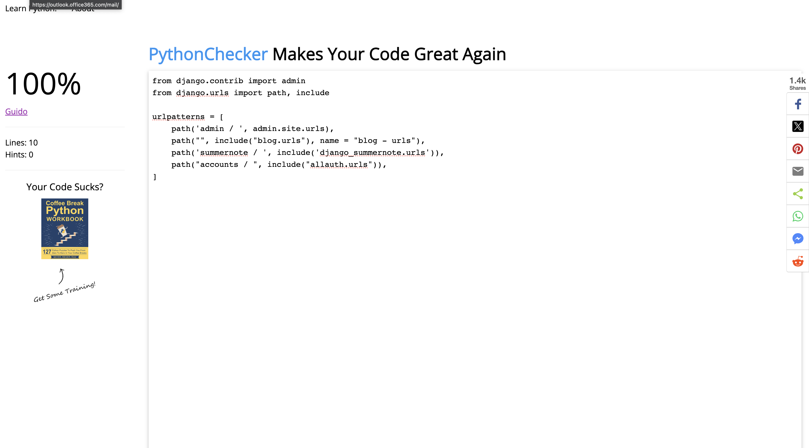

# **_Bakers Hub - Project Portfolio 4 - Full Stack_**

Bakers Hub is a dynamic online platform that serves as a community hub for baking enthusiasts and professionals. This project is designed to provide a comprehensive experience for users, offering both a user-friendly front-end for accessing and sharing baking recipes and a robust back-end management system for contributors and administrators. I wanted to keep this application very simple and sleek, with room for improvement, I wanted the application to be purely about the baking and not about anything flashy.

This is for the real bakers and for aspiring!

You can view the live site here - <a href="https://bakershub-2af44a4fc0e7.herokuapp.com/" target="_blank" rel="noopener">Bakers Hub</a>

# Contents

* [**Objective**](<#objective>)
* [**User Experience UX**](<#user-experience-ux>)
    * [User Stories](<#user-stories>)
    * [Design Prototype](<#design-prototype>)
    * [Site Structure](<#site-structure>)
    * [Design Choices](<#design-choices>)
    *  [Typography](<#typography>)
    *  [Colour Scheme](<#colour-scheme>)
    * [Project Management](<#project-management>)
* [**Existing Features (Site User)**](<#existing-features-for-site-user>)
    * [Site Navigation Bar](<#site-responsive-navigation-bar>)
    * [Article](<#article>)
    * [Article Details](<#article-details>)
    * [Comment](<#comment>)
    * [Like](<#like>)
    * [Footer](<#footer>)
    * [Sign Up](<#sign-up>)
    * [Login](<#login>)
* [**Existing Features (Admin)**](<#existing-features-for-admin>)
    * [Articles](<#Articless>)
    * [Comments](<#comments>)
    * [Accounts](<#accounts>)
* [**Future Features**](<#future-features>)
    * [Article Creation](<#article-creation>)
    * [Gallery](<#gallery>)
    * [User Profile Page](<#user-profile-page>)
* [**Technologies Used**](<#technologies-used>)
* [**Python Packages**](<#python-packages>)
* [**Bugs and Fixes**](<#bugs-and-fixes>)
* [**Testing**](<#testing>)
* [**Deployment To Heroku**](<#deployment-to-heroku>)
* [**Credits**](<#credits>)
    * [**Content**](<#content>)
    * [**Media**](<#media>)
*  [**Acknowledgments**](<#acknowledgements>)

# Objective

For my fourth project, I aim to develop a practical platform for a baking community, showcasing my proficiency in various technologies. The primary goal is to create an authentic and user-friendly website that can be seamlessly applied in a real-world context. This project will serve as a testament to my expertise in HTML, CSS, JavaScript, Python, and the Django Framework, highlighting attention to detail testing practices throughout the development process.

[Back to top](<#contents>)

# User Experience (UX)

## User Stories

### Site User

|  | | |
|:-------:|:--------|:--------|
| As a Site User | I can view a list of posts so that I can select one to read | &check; |
| As a Site User | I can click on a post so that I can read the full text | &check; |
| As a Site User | I can view the number of likes on each post so that I can see which is the most popular or viral | &check; |
| As a Site User | I can view comments on an individual post so that I can read the conversation | &check; |
| As a Site User | I can register an account so that I can comment and like | &check; |
| As a Site User | I can leave comments on a post so that I can be involved in the conversation | &check; |
| As a Site User | I can like or unlike a post so that I can interact with the content| &check; |

### Site Admin

|  | | |
|:-------:|:--------|:--------|
| As a Site Admin | I can view the number of likes on each post so that I can see which is the most popular or viral | &check; |
| As a Site Admin | I can view comments on an individual post so that I can read the conversation | &check; |
| As a Site Admin | I can create, read, update and delete posts so that I can manage my blog content| &check; |
| As a Site Admin | I can create draft posts so that I can finish writing the content later| &check; |
| As a Site Admin | I can approve or disapprove comments so that I can filter out objectionable comments | &check; |

## Design Prototype

The design wireframes were created using [Figma](https://www.figma.com/). I created a very basic wire frame as I knew that I didn't wannt the webpage to be too complicated, I wanted the focus to just be on recipes and I wanted it to be accessable for all- complicated webpages reduce accessibility and I highly wanted to avoid this. This is an extremely important part of the design process as it allows me to understand what components I want to add where.<br /><br />


[Back to top](<#contents>)

## Site Structure

* Main User Website
    * Home, Sign Up, Article Detail, Login.
    * Accessible, simple and cohesive design.
    * Simple, easy viewing of different recipes.
    * Interaction is easy with just liking and commenting- no overstimulation.

* Admin
    * Functionality to manage and add to articles, comments and accounts.


## Design Choices

 * ### Typography
      The font I chose for the main 'Bakers|Hub' title was 'Satsify' in order to make it stand out and also as I feel it suited the baking aesthetic. I think it is still clear to read and adds some variety to the simplistic webpage. I decided to add this font to the text in the heading for the same reasons.

    * I chose 'Playfair Display' for the rest of my webpage as I still wanted to prioritize simplicity and accessability. This font is highly easy to read and it is clear and crisp, I knew it was the perfect choice for the webpage. When looking at recipes I wanted users to be able to clearly and quickly access recipies whilst in the kitchen and not have to worry about not being able to actually read the words. As recipies can get long and wordy, this was a valid concern. I added 'sans-serif' as the font that the browser can fall back onto if the former fonts weren't available.

 * ### Colour Scheme
      The colour scheme chosen is a mostly green and black with touches of pink. I wanted to site to appear professional and calming which were my reasons for chosing the green and black colours, however I still wanted to add some fun with the pink. Calming and fun, just like baking!<br /><br />


## Project Management

 * ### GitHub Project Board
In the management of the Bakers Hub project, I extensively employed GitHub's robust project management features, including GitHub Projects, Issues, and Kanban boards. This approach allowed me to effectively break down, organize, and plan user stories, demonstrating my adeptness at project planning within an Agile framework. Despite being a solo project, the utilization of GitHub's tools proved invaluable. <br /><br />


## Existing Features For Site User

  * ### Site Responsive Navigation Bar

      * The navigation bar is simple with the home, sign up and login links. The Bakers|Hub site links back to the homepage aswell. The navigation header section also includes a quote on the right hand side for something fun and different. On smaller screens this collapses into a burger menu icon.<br /><br />


</details><br />


  * ### Article

      * The Articles posted in the hub site can be seen in the homepage, I aimed to keep the presentation clean and minimal, the light background contrasts well with the images providing a fresh feel. Users can scroll and see the different recipies in which they can explore and look at without feeling overwhelmed with different things on the page - only recipies. For further context their is the detail of the post maker on the images, followed by a title of the recipe, brief description and the like/comment count. So users can see the newest recipies first I included the publication dates on the articles and made it to the newest ones will appear at the top. For regular visitors this is great as it means that when revisiting they're always met with new and exciting recipies without having to continuously scroll to fish out new entries.<br /><br />


</details><br />

  * ### Article Details

      * The Articles posted in the hub site can be seen in the homepage, when users click on the recipe title they're taken to a article details page where they can view the actual recipe. This page includes all the details that were previously stated on the homepage but also has the ingredients needed for the recipe and the instructions to make the treat too. At the bottom of this page you can find the functionality to like the post and add/read comments which I will detail shortly below.<br /><br />


</details><br />

  * ### Comment

      * The Articles Details page ends with the user being able to leave a comment or view comments made on the post. The post has to wait for admin approval before it can be published onto the post but the user recieves a confirmation message regardless so they know the comment has been processed while they wait.<br /><br />


</details><br />


  * ### Like

      * The Articles Details page ends with the user being able to leave a comment or view comments made on the post. The post has to wait for admin approval before it can be published onto the post but the user recieves a confirmation message regardless so they know the comment has been processed while they wait.<br /><br />


</details><br />


  * ### Footer

      * The Footer is sleek and simple, a warming forest green with white writing to further accesibility, it include various social media icons with links- for educational purposes of course so they only lead to the homepage of each respective site.<br /><br />


</details><br />


  * ### Sign Up

      * Users are given a simple sign up page which follows the colour scheme of the rest of the site.<br /><br />


</details><br />


  * ### Login

      * Users are given a simple sign in page which follows the colour scheme of the rest of the site, of course they are also able to navigate to the logout navigation link and click the signout button.<br /><br />


</details><br />

## Existing Features For Admin

  * ### Articles

      * The admin is able to view all article, article details and create articles and see who has read the article. The admin is even able to delete articles.<br /><br />


</details><br />


  * ### Comments

      * The admin is able to view all comments and approve or disapprove of comments.<br /><br />


</details><br />

  * ### Articles

      * The admin is able to view all user accounts, see whether they are staff or not and delete the user if needed.<br /><br />


</details><br />

* ## Future Features 

* ### Article Creation 

    * The current webpage followed thee codestar Code Institute blog. As I has failed making my own project before I wanted to follow the functionality of the codestar blog and not do anything to make my site crash. This means that my site doesn't yet allow users to create an article themselves, I will definitely aim to add this functionality in the future for better interactivity.

* ### Gallery

    * A gallery where users can view pretty baking photos without any text for inspiration is something that I believe would be very beneficial. As stated throughout this readme, simplicity is something I find valuable and in this day and age alot of users are just looking for something they can look at and scroll through without having to process much- bingo! A gallery.

* ### User Profile Page

    * Currently, when a user creates an account on Bakers Hub, all the essential functionalities for navigation, recipe submissions, and engagement with the platform are available. However, I am working on introducing a specialized profile page that will enable users to personalize their experience by changing and viewing profile details, accessing their recipe submissions, reviewing interactions and exploring personalized data related to their baking journey on Bakers Hub.


# Technologies Used
* [Django](https://www.djangoproject.com/) - A model-view-template framework used to create Bakers Hub.
* [Bootstrap](https://getbootstrap.com/) - A CSS framework used to aid in front-end development 
* [HTML5](https://en.wikipedia.org/wiki/HTML) - Provides the content and structure for the website.
* [CSS3](https://en.wikipedia.org/wiki/CSS) - Provides the styling for the website.
* [JavaScript](https://en.wikipedia.org/wiki/JavaScript) - Provides interactive elements of the website.
* [Python](https://en.wikipedia.org/wiki/Python_(programming_language)) - Provides the functionality of the website.
* [a11y](https://color.a11y.com/Contrast/) - Used to test the contrast and accessibility.
* [GitHub](https://github.com/) - Used to host and deploy the website.
* [Gitpod](https://www.gitpod.io/) - Used to develop the application.
* [Google Chrome DevTools](https://developer.chrome.com/docs/devtools/) - Used to test responsiveness and debug.
* [Responsive Design Checker](https://www.responsivedesignchecker.com/) - Used to test responsiveness.
* [Figma](https://www.figma.com/) - Used to create the wire-frame.
* [Cloudinary](https://cloudinary.com/) - Used to host all static files.
* [Heroku](https://dashboard.heroku.com) - Used to deploy the website.
* [Python Checker](https://www.pythonchecker.com/) - Used to validate Python code.
* [HTML Validation](https://validator.w3.org/) - Used to validate HTML code.
* [CSS Validation](https://jigsaw.w3.org/css-validator/) - Used to validate CSS code.
* [JSHint Validation](https://jshint.com/) - Used to validate JavaScript code.


# Libraries

All the libraries used for this project are located in the requirements.txt file which has been created in a virtual environment.


* [asgiref](https://pypi.org/project/asgiref/) - ASGI reference implementation, including a server (Daphne), specification, and utilities.
* [cloudinary](https://pypi.org/project/cloudinary/) - Cloudinary is a cloud service that offers a solution to a web application’s entire image management pipeline.
* [dj-database-url](https://pypi.org/project/dj-database-url/) - Use Database URLs in your Django application.
* [dj3-cloudinary-storage](https://pypi.org/project/dj3-cloudinary-storage/) - A Django storage backend for Cloudinary.
* [Django](https://pypi.org/project/Django/) - Django is a high-level Python web framework that encourages rapid development and clean, pragmatic design.
* [django-allauth](https://pypi.org/project/django-allauth/) - Integrated set of Django applications addressing authentication, registration, account management as well as 3rd party (social) account authentication.
* [django-crispy-forms](https://pypi.org/project/django-crispy-forms/) - Used to integrate Django DRY forms.
* [django-summernote](https://pypi.org/project/django-summernote/) - Summernote plugin for Django.
* [gunicorn](https://pypi.org/project/gunicorn/) - Gunicorn ‘Green Unicorn’ is a Python WSGI HTTP Server for UNIX.
* [oauthlib](https://pypi.org/project/oauthlib/) - A generic, reusable library for implementing OAuth1 and OAuth2.
* [psycopg2](https://pypi.org/project/psycopg2/) - Psycopg is the most popular PostgreSQL database adapter for the Python programming language.
* [PyJWT](https://pypi.org/project/PyJWT/) - JSON Web Token implementation in Python.
* [python3-openid](https://pypi.org/project/python3-openid/) - Python OpenID library.
* [pytz](https://pypi.org/project/pytz/) - World timezone definitions, modern and historical.
* [requests-oauthlib](https://pypi.org/project/requests-oauthlib/) - OAuthlib authentication support for Requests.
* [sqlparse](https://pypi.org/project/sqlparse/) - Non-validating SQL parser.


# Testing

* ## Code Validation

    * Bakers Hub has been validated by using online validation tools [W3C HTML Validator](https://validator.w3.org/), [W3C CSS Validator](https://jigsaw.w3.org/css-validator/), [JSHint JavaScript Validator](https://jshint.com/) and the [Python Checker](https://www.pythonchecker.com/).

* ### HTML Validation Image

    

* ### CSS Validation Image

    

* ### JSHint map.js Image

    

* # Python Validation Image 

 *  Some of the screenshots present an error simply because the lines should not be longer than 79 characters however this is not an error to cause concern.


    
    
    
    
    
    

    </details><br />

* ## Lighthouse Testing 

    * Furthermore the website has been through the [Chrome Dev Tools](https://developer.chrome.com/docs/devtools/) Lighthouse Testing which tests the website for the following:
        * Performance - How the page performs whilst loading.
        * Accessibility - Is the site accessible for all players and how can it be improved.
        * Best Practices - Site conforms to industry best practices.
        * SEO - Search Engine Optimisation. Is the site optimised for search engine result rankings.

    * The lighthouse tests were conducted in incognito/private windows due to extensions interfering with the results.<br /><br />

* ### Chrome Desktop Lighthouse Result

    
    
    
    


* ## Accessibility Testing
    * I also put the website through [a11y](https://color.a11y.com/Contrast/) to further test the contrast and found no issues. <br /><br />

    

* ## Responsiveness Testing
    * I conducted responsive tests manually with [Google Chrome DevTools](https://developer.chrome.com/docs/devtools/), I did this by changing the device at the top to see how it would display on various devices.<br /><br />

    
    
    
    

* ## Manual Testing
In addition to the other tests, I have conducted a manual check list for myself to carry out to make sure that everything is working as intended.


## Site User

- **View Posts:**
  - ✔ I can view a list of posts so that I can select one to read.

- **Read Full Post:**
  - ✔ I can click on a post so that I can read the full text.

- **View Likes:**
  - ✔ I can view the number of likes on each post so that I can see which is the most popular or viral.

- **View Comments:**
  - ✔ I can view comments on an individual post so that I can read the conversation.

- **Register Account:**
  - ✔ I can register an account so that I can comment and like.

- **Leave Comments:**
  - ✔ I can leave comments on a post so that I can be involved in the conversation.

- **Like/Unlike Posts:**
  - ✔ I can like or unlike a post so that I can interact with the content.

## Site Admin

- **View Likes:**
  - ✔ I can view the number of likes on each post so that I can see which is the most popular or viral.

- **View Comments:**
  - ✔ I can view comments on an individual post so that I can read the conversation.

- **CRUD Operations on Posts:**
  - ✔ I can create, read, update, and delete posts so that I can manage my blog content.

- **Create Draft Posts:**
  - ✔ I can create draft posts so that I can finish writing the content later.

- **Approve/Disapprove Comments:**
  - ✔ I can approve or disapprove comments so that I can filter out objectionable comments.

* ## Browser Compatibility
    * The website has had manual and responsive tests conducted on the below browsers with additional Lighthouse testing on Google Chrome and I was presented with no issues.
        * Google Chrome
        * Microsoft Edge
        * Safari
        <br /><br />

* ## Bugs Fixed 

    ### ENV.PY
        
    * A bug I encountered and was able to fix entailed having to move my env.py file to the root directory so I could migrate my changes, beforehand it wasn't in the correct directory and migrations were causing an error. <br /><br />

    


     ### Allowed Host
        
    * A bug I encountered and was able to fix entailed adding the link of my applications to the allowed hosts in the settings.py file of the project so I could successfully deploy my project onto Heroku in my initial deployment. <br /><br />

    

* ## Bugs Unfixed
 
    ### Forgot your password?

    * There is a faulty link that urges users to press it if they have forgotten their password, to reset it, however I was going to remove it as the walkthrough for CodeStar guided me to but I was unable to do so as I had to manually transfer my templates and the template with that link was unavailable to me. Meaning I was unable to remove it from my form. 

    ### commentor name

    * Another bug I wish I could have fixed was the fact that the commentors name does not appear next to the comment and there is no reason why. I done extensive troubleshooting but was unfortunately unable to rectify this bug. I aim to fix it in the next release of this webpage.

    [Back to top](<#contents>)


# Deployment To Heroku
  
The project was deployed to [Heroku](https://www.heroku.com). The deployment process is as follows: 
  
### 1. Create a new GitHub repository from CI template:

* Firstly we need to create a new GitHub repository. Head over to this [link](https://github.com/Code-Institute-Org/gitpod-full-template) and click 'Use this template'</br></br>


* Fill in the appropriate details and then click 'Create repository from template'</br></br>
* Create your respository and open it up in Gitpod.


### 2. Installing Django and supporting libraries:

* Now it's time to install Django and it's supporting libraries. In the terminal, type the following commands: <br/><br/>
    * ```pip3 install 'django<3.2' gunicorn```
    * ```pip3 install dj_database_url psycopg2```
    * ```pip3 install dj3-cloudinary-storage```
<br/><br/>

* After you have successfully installed the above, type the following command: <br/><br/>
    * ```pip3 freeze --local > requirements.txt```
    <br/><br/>

* This will create a requirements.txt file. <br/><br/>

* Now we need to create our Django project and the applications. In the terminal type the following command: <br/><br/>

    * ```django-admin startproject PROJ_NAME .``` 
    * ```django-admin startapp APP_NAME .``` <br/><br/>

* You then need to add your application to the INSTALLED_APPS section in your settings.py as shown below</br></br>

* Then type the following commands in the terminal:  <br/><br/>
    * ```python manage.py migrate```  
    * ```python manage.py runserver```   <br/><br/>

### 3. Deploying an app to Heroku:

* After you have successfully navigated to [Heroku](https://dashboard.heroku.com/apps), created an account and logged in, click 'New' and then click 'Create new app'</br></br>
* Pick a suitable app name and choose your preferred region. Since I live in the United Kingdom, I have chosen Europe as my region</br></br>

* Inside your application, click the 'Resources' tab and then search for 'Heroku Postgres'. Attach this to your project as a database by clicking 'Submit Order Form'. If done correctly, you should see the below image.</br></br>

* If you click the Heroku Postgres link, it will then open a new page which has all the information about your new Heroku Postgres database. This is where we will find our credentials. Click 'Settings' and then click 'View Credentials' and you will then see the below image (with your details not mine)

* The piece of information that we are particularly interested in, is the URI. </br></br>

* Since we are in Heroku, navigate to your project settings and click 'Reveal Config Vars'. Add your Heroku config vars to your project as shown below 

    * DISABLE_COLLECTSTATIC = 1 is a temporary step for the moment and it will be removed before deployment</br></br>

* Create a new file called ***env.py*** and ensure this is added to your gitignore file. Copy the below code but change the variable content to your specific details.</br></br>

* In settings.py, look for the line that says '**from pathlib import Path**' and then insert the code below.</br></br>

* Replace the default random security key that Django provides with your SECRET_KEY that you created in your env.py file.</br></br>

* Set **DEBUG = 'DEVELOPMENT' in os.environ**. This allows you to have DEBUG set to True when developing locally, however DEBUG will be set to False when deployed to Heroku.</br></br> 

* Add the cloudinary application to the INSTALLED_APPS in settings.py. Take notice of the order, this is important.</br></br>

* Find **STATIC_URL = '/static/'** in your settings.py file and tell Django to use Cloudinary to store media and static files.</br></br>

* Add your allowed hosts to ALLOWED_HOSTS.</br></br>

* Now we need to create 3 new folders and 1 new file on the top level directory </br></br>
    * **media** (folder)
    * **static** (folder)
    * **templates** (folder)
    * **Procfile** (file)

* Within the Procfile, add the following line of code ```web: gunicorn PROJ_NAME.wsgi```. PROJ_NAME is the name of your application. If done correctly, your project directory should look like the below image.

* Make sure to save all files and then type the following commands in the terminal: </br></br>
    * ```git add .```
    * ```git commit -m "Deployment commit"```
    * ```git push```

* The final step is to then deploy your application. My preferred way of deployment was to use the Heroku CLI. </br></br>
    * ```heroku login``` - This will open a new window for you to log in
    * ```heroku git:remote -a PROJ_NAME``` - This will tell Heroku to build your application from this repo 
    * ```git push heroku main``` - This will build your application</br></br>


The live link to the Github repository can be found here - https://github.com/NaifatSelina/BakersHub

[Back to top](<#contents>)

# Credits

### Content

* I used the amazing I Think Therefore I blog walkthrough as inspiration for my BakerHub site- it massively helped me.

### Media

* All the images used were from [Pexels](https://www.pexels.com/).
* The icons were from [Font Awesome](https://fontawesome.com/).


[Back to top](<#contents>)

Naifat 2024.

[Back to top](<#contents>)